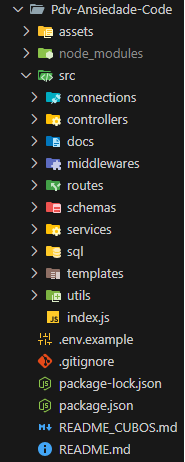
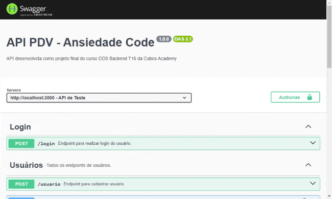

# API REST PDV: Ansiedade Code 🧠


## Sobre o Projeto

Este projeto consiste em uma API REST para um PDV (Ponto de Venda) ou frente de caixa, destinada a controlar categorias, usuários, clientes, produtos e pedidos utilizados por um estabelecimento comercial tendo sido proposto como Desafio Final do curso de Backend da [Cubos Academy](https://cubos.academy/). O projeto foi desenvolvido em grupo e dividido em 03 (três) sprints. O objetivo desse projeto é fornecer uma base para a construção de um sistema completo de um PDV.

A API permite realizar, no momento, operações como: cadastro e edição de dados de usuários, autenticação, cadastro, listagem, exclusão e edição de dados de produtos, cadastro, listagem e edição de dados de clientes e cadastro de pedidos de venda.


## Índice

- [Tecnologia Utilizadas](#tecnologias-utilizadas)
- [Estrutura do Projeto](#estrutura-do-projeto)
- [Como Executar o Projeto](#como-executar-o-projeto)
- [Documentação da API](#documentação-da-api)
- [Deploy](#deploy)
- [Contribuição](#contribuição)
- [Autores](#autores)


## Tecnologias Utilizadas


#### Dependências Utilizadas

| Dependências        | Versão      |
| :------------------ | ----------- |
| express             | 4.19.2      |
| nodemon (dev)       | 3.1.4       |
| bcrypt              | 5.1.1       |
| cors                | 2.8.5       |
| date-fns-tz         | 3.1.3       |
| dotenv              | 16.4.5      |
| handlebars          | 4.7.8       |
| joi                 | 17.13.3     |
| jsonwebtoken        | 9.0.2       |
| knex                | 3.1.0       |
| multer              | 1.4.5-lts.1 |
| nodemailer          | 6.9.14      |
| pg                  | 8.12.0      |
| swagger-ui-express  | 5.0.1       |
| swagger-jsdoc (dev) | 6.2.8       |
| @aws-sdk/client-s3  | 3.632.0     |
| @fnando/cpf         | 1.0.2       |


## Estrutura do Projeto

O projeto da API foi organizado de forma a manter a clareza e a modularidade, onde as imagens do projeto foram inseridas no diretório `assets` e tudo relacionado a API foi inserido dentro da pasta `src`, como segue:

- Arquivo `index.js`: onde a execução do servidor é iniciada, sendo o ponto central da aplicação, pois é onde se inicia a escuta por requisições e configuração da documentação Swagger;

- Pasta `connections`: Contém as configurações de conexão ao banco de dados PostgreSQL e também ao ambiente em nuvem para armazenamento do upload de imagens;

- Pasta `controllers`: Esta pasta abriga todas os métodos responsáveis por executar as operações relacionadas às rotas da API;

- Pasta `docs`: Contém tudo relacionado a documentação Swagger que foi gerada;

- Pasta `middlewares`: Contém as definições de `middlewares`, que são funções intermediárias que podem ser executadas antes das rotas ou após as requisições;

- Pasta `routes`: Esta pasta contém todos os arquivos onde as rotas da API estão definidas;

- Pasta `schemas`: Nesta pasta, estão armazenados os `schemas` que definem a estrutura e as restrições dos objetos de dados utilizados pela API;

- Pasta `services`: Esta pasta abriga todas os métodos responsáveis por executar as operações necessárias junto ao banco de dados e retornar para o controlador;

- Pasta `sql`: Contém o script `dump.sql` com os comandos sql necessários para construir as tabelas do banco de dados no PostgreSQL;

- Pasta `templates`: Esta pasta armazenas os templates html utilizados no envio de emails de Redefinição de Senha e de Finalização do Pedido.

- Fora da pasta `src`, na raiz do projeto, contém os seguintes arquivos:

  -  `.env.exemple`: Esse arquivo é um modelo com todas as variáveis de ambiente utilizadas no projeto.
  - `.gitignore`: Contém os arquivos e diretórios que não "subirão" para o repositório remoto.
  - `README_CUBOS`: É o README com as instruções que deveriam ser seguidas neste Desafio proposto pela Cubos Academy.

  


## Como executar o projeto

⚠️ Para a execução do projeto, é necessário ter o [Node.js](https://nodejs.org/en) instalado em sua máquina.

1) Faça um clone do projeto
- Via SSH

```bash
git clone git@github.com:peucabral85/Pdv-Ansiedade-Code.git
```
- Via HTTP

```bash
git clone https://github.com/peucabral85/Pdv-Ansiedade-Code.git
```

2) Abra o diretório do projeto

```bash
cd Pdv-Ansiedade-Code
```

3) Instale as dependências utilizando o comando:

```bash
npm i
```

4. Crie um arquivo `.env` na raiz do projeto e configure as variáveis de ambiente necessárias. Um exemplo de configuração pode ser encontrado no arquivo `.env.example` ou como abaixo:

```
PORT_SERVER=

CLIENT_DB=
HOST_DB=
PORT_DB=
USER_DB=
PASS_DB=
NAME_DB=

PASS_JWT=

EMAIL_HOST=
EMAIL_PORT=
EMAIL_USER=
EMAIL_PASS=
EMAIL_NAME=
EMAIL_FROM=

STORAGE_REGION=
STORAGE_ENDPOINT=
STORAGE_ACCESSKEY=
STORAGE_SECRET_ACCESSKEY=
STORAGE_BUCKET=
STORAGE_BASEURL=
```

5. Inicialize o servidor local:

```bash
npm run dev
```

6. Após iniciar o servidor, você pode acessar a API de 02 (duas) formas: 

- Utilizando o Insomnia ou Postman, por exemplo, com o seguinte endereço:

``` bash
http://localhost:3000
```

- Utilizando a documentação Swagger do projeto:

```bash
http://localhost:3000/api-docs
```


## Documentação da API

Uma documentação completa desta API foi desenvolvida no Swagger.

Acesse: [Documentação Swagger da API](https://pdv-ansiedade-code.onrender.com/api-docs)

###### 	Obs.: Pode levar até 50 segundos para o 1º acesso.




Abaixo, também estão descritos todos os endpoints da API.

#### Cadastrar Usuário 

```http
  POST /usuario
```

| Parâmetro | Tipo     | Descrição                                          |
| :-------- | :------- | :------------------------------------------------- |
| `nome`    | `string` | **Obrigatório**. Nome do usuário.                  |
| `email`   | `string` | **Obrigatório**. Email do usuário.                 |
| `senha`   | `string` | **Obrigatório**. Senha de autenticação do usuário. |

*Validações:*

    -   Valida o preenchimento dos campos obrigatórios;
    -   Valida se o e-mail informado já existe;
    -   Criptografa a senha antes de persistir no banco de dados;

*Exemplo de Requisição:*

```json
{
	"nome": "Messias dos Anjos",
	"email": "messiasdosanjos8709@exemplo.com",
	"senha": "123456"
}
```


#### Realizar Login

```http
  POST /login
```

| Parâmetro | Tipo     | Descrição                                          |
| :-------- | :------- | :------------------------------------------------- |
| `email`   | `string` | **Obrigatório**. Email do usuário                  |
| `senha`   | `string` | **Obrigatório**. Senha de autenticação do usuário. |

*Validações:*

    -   Valida o preenchimento dos campos obrigatórios;
    -   Valida e-mail e senha;
    -   Gera token de autenticação com id do usuário.

*Exemplo de Requisição:*

```json
{
	"email": "messiasdosanjos8709@exemplo.com",
	"senha": "123456"
}
```


#### Redefinir Senha do Usuário Logado

 ```http
  PATH /usuario/redefinir
 ```

| Parâmetro      | Tipo     | Descrição                                |
| :------------- | :------- | :--------------------------------------- |
| `email`        | `string` | **Obrigatório**. Email do usuário.       |
| `senha_antiga` | `string` | **Obrigatório**. Senha atual do usuário. |
| `senha_nova`   | `string` | **Obrigatório**. Nova senha do usuário.  |

*Validações:*

    -   Valida o preenchimento dos campos obrigatórios;
    - 	Valida se a senha antiga é igual nova senha;
    -   Valida e-mail e senha;
    -   Criptografa a nova senha antes de persistir no banco de dados;
    - 	Envia email ao usuário informando a alteração de senha;

*Exemplo de Requisição:*

```json
{
	"email": "messiasdosanjos8709@exemplo.com",
	"senha_antiga": "123456",
    "senha_nova": "1234"
}
```


#### Detalhar Usuário Logado

> [!IMPORTANT]
>
> Endpoint necessita de token de autenticação válido.

```http
  GET /usuario
```


#### Atualizar Dados do Usuário Logado

> [!IMPORTANT]
>
> Endpoint necessita de token de autenticação válido.

```http
  PUT /usuario
```

| Parâmetro | Tipo     | Descrição                           |
| :-------- | :------- | :---------------------------------- |
| `nome`    | `string` | **Obrigatório**. Nome do usuário.   |
| `email`   | `string` | **Obrigatório**. E-mail do usuário. |

*Validações:*

    -   Valida o preenchimento dos campos obrigatórios;
    -   Valida se o novo e-mail já existe no banco de dados para outro usuário;

*Exemplo de Requisição:*

```json
{
	"email": "messiasdosanjos8709@exemplo.com",
	"senha": "123456"
}
```


#### Listar Categorias

```http
  GET /categoria
```


#### Cadastrar Produto

> [!IMPORTANT]
>
> Endpoint necessita de token de autenticação válido.

```http
  POST /produto
```

| Parâmetro            | Tipo      | Descrição                                                    |
| :------------------- | :-------- | :----------------------------------------------------------- |
| `descricao`          | `string`  | **Obrigatório**. Descrição do produto.                       |
| `quantidade_estoque` | `integer` | **Obrigatório**. Quantidade do produto em estoque. Deve ser um número inteiro positivo. |
| `valor`              | `integer` | **Obrigatório**. Valor do produto. Deve ser um número inteiro positivo (representação em centavos). |
| `categoria_id`       | `integer` | **Obrigatório**. ID da categoria correspondente. Deve ser um número inteiro positivo. |

*Validações:*

    -   Valida o preenchimento dos campos obrigatórios;
    -   Valida se a categoria informada existe;

*Exemplo de Requisição:*

```json
{
	"descricao": "Samsung Galaxy S23 FE 5G 128 GB Grafite",
	"quantidade_estoque": 23,
	"valor": 269900,
	"categoria_id": 9
}
```


#### Atualizar dados do produto

> [!IMPORTANT]
>
> Endpoint necessita de token de autenticação válido.

```http
  PUT /produto/:id
```

| Parâmetro            | Tipo      | Descrição                                                    |
| :------------------- | :-------- | :----------------------------------------------------------- |
| `id`                 | `integer` | **Obrigatório**. ID do produto cadastrado. A ser passado como parâmetro na rota. |
| `descricao`          | `string`  | **Obrigatório**. Descrição do produto.                       |
| `quantidade_estoque` | `integer` | **Obrigatório**. Quantidade do produto em estoque. Deve ser um número inteiro positivo. |
| `valor`              | `integer` | **Obrigatório**. Valor do produto. Deve ser um número inteiro positivo (representação em centavos). |
| `categoria_id`       | `integer` | **Obrigatório**. ID da categoria correspondente. Deve ser um número inteiro positivo. |

*Validações:*

    -   Valida se existe produto para o id informado como parâmetro na rota;
    -   Valida o preenchimento dos campos obrigatórios;
    -   Valida se a categoria informada existe;

*Exemplo de Requisição:*

```json
{
	"descricao": "Samsung Galaxy S23 FE 5G 128 GB Grafite",
	"quantidade_estoque": 23,
	"valor": 269900,
	"categoria_id": 9
}
```


#### Listar Produtos Cadastrados

> [!IMPORTANT]
>
> Endpoint necessita de token de autenticação válido.

```http
  GET /produto
  GET /produto?categoria_id=${numero}
```

| Parâmetro      | Tipo      | Descrição                                                    |
| :------------- | :-------- | :----------------------------------------------------------- |
| `categoria_id` | `integer` | **Opcional**. A ser passado como parâmetro de consulta na rota. |

*Validações:*

    -   Caso não seja informado um id de categoria como parâmetro do tipo query, o endpoint deverá responder com todos os produtos cadastrados no sistema;
    -  Caso seja informado um id de categoria como parâmetro do tipo query, o endpoint deverá responder com todos os produtos cadastrados no sistema com a categoria informada.


#### Detalhar produto

> [!IMPORTANT]
>
> Endpoint necessita de token de autenticação válido.

```http
  GET /produto/:id
```

| Parâmetro | Tipo      | Descrição                                                    |
| :-------- | :-------- | :----------------------------------------------------------- |
| `id`      | `integer` | **Obrigatório**. ID do produto cadastrado. A ser passado como parâmetro na rota. |

*Validações:*

    -   Valida se existe produto para o id enviado como parâmetro na rota.


#### Upar Imagem de Produto

> [!IMPORTANT]
>
> Endpoint necessita de token de autenticação válido.

```http
  PATCH /produto/:id/imagem
```

| Parâmetro | Tipo      | Descrição                                                    |
| :-------- | :-------- | :----------------------------------------------------------- |
| `id`      | `integer` | **Obrigatório**. ID do produto cadastrado. A ser passado como parâmetro na rota. |
| `imagem`  | `file`    | **Opcional**. Pode ser anexada uma imagem para ser salva no banco de dados. É salvo o path da URL do local onde a imagem ficará hospedada. |

*Validações:*

    -	  Valida se existe produto para o id enviado como parâmetro na rota.
    -	  Valida se a propriedade `imagem`, foi informada no corpo da requisição.
    -	  Recebe a propriedade `imagem` em form data (Multipart) e envia para o servidor de armazenamento.
    -	  Obtem e retorna a URL da imagem que teve o upload concluído.
    - 	Caso o produto já possua imagem, há a substituição da atual pela nova.
    - 	Caso a propriedade `imagem` seja passada em branco, a imagem atual do produto é deletada.


#### Deletar Produto

> [!IMPORTANT]
>
> Endpoint necessita de token de autenticação válido.

```http
  DELETE /produto/:id
```

| Parâmetro | Tipo      | Descrição                                                    |
| :-------- | :-------- | :----------------------------------------------------------- |
| `id`      | `integer` | **Obrigatório**. ID do produto cadastrado. A ser passado como parâmetro na rota. |

*Validações:*

    -   Valida se existe produto para o id enviado como parâmetro na rota.
    - 	Valida se existem pedidos vinculados ao produto, caso sim, não é permitida a exclusão.
    -	Na exclusão do produto a imagem vinculada a este produto deverá ser excluída do servidor de armazenamento.


#### Cadastrar Clientes

> [!IMPORTANT]
>
> Endpoint necessita de token de autenticação válido.

```http
  POST /cliente
```

| Parâmetro | Tipo     | Descrição                               |
| :-------- | :------- | :-------------------------------------- |
| `nome`    | `string` | **Obrigatório**. Nome do cliente.       |
| `email`   | `string` | **Obrigatório**. E-mail do cliente.     |
| `cpf`     | `string` | **Obrigatório**. CPF válido do cliente. |
| `cep`     | `string` | **Opcional**. CEP do cliente.           |
| `rua`     | `string` | **Opcional**. Nome da rua.              |
| `numero`  | `string` | **Opcional**. Número da residência.     |
| `cidade`  | `string` | **Opcional**. Nome da Cidade.           |
| `estado`  | `string` | **Opcional**. Nome do Estado.           |

*Validações:*

    -   Valida o preenchimento dos campos obrigatórios;
    -   Valida se o e-mail e cpf informados já existem;

*Exemplo de Requisição*:

```json
{
  "nome": "Malaquias de Jesus Santos",
  "email": "malaquiasjsantos@gmail.com",
  "cpf": "136.015.055-25",
  "cep": "45051-140",
  "rua": "Avenida Serrinha",
  "numero": "1908",
  "bairro": "Brasil",
  "cidade": "Vitória da Conquista",
  "estado": "Bahia"
}
```


#### Atualizar Dados de Clientes Cadastrados

> [!IMPORTANT]
>
> Endpoint necessita de token de autenticação válido.

```http
  PUT /cliente/:id
```

| Parâmetro | Tipo      | Descrição                                                    |
| :-------- | :-------- | :----------------------------------------------------------- |
| `id`      | `integer` | **Obrigatório**. ID do cadastro do cliente. A ser passado como parâmetro na rota. |
| `nome`    | `string`  | **Obrigatório**. Nome do cliente.                            |
| `email`   | `string`  | **Obrigatório**. E-mail do cliente.                          |
| `cpf`     | `string`  | **Obrigatório**. CPF válido do cliente.                      |
| `cep`     | `string`  | **Opcional**. CEP do cliente.                                |
| `rua`     | `string`  | **Opcional**. Nome da rua.                                   |
| `numero`  | `string`  | **Opcional**. Número da residência.                          |
| `cidade`  | `string`  | **Opcional**. Nome da Cidade.                                |
| `estado`  | `string`  | **Opcional**. Nome do Estado.                                |

*Validações:*

    -   Valida se existe cliente para o id enviado como parâmetro na rota.
    -   Valida o preenchimento dos campos obrigatórios;
    -	Valida se o e-mail e cpf informados já existem;

*Exemplo de Requisição*:

```json
{
  "nome": "Malaquias de Jesus Santos",
  "email": "malaquiasjsantos@gmail.com",
  "cpf": "136.015.055-25",
  "cep": "45051-140",
  "rua": "Avenida Serrinha",
  "numero": "1908",
  "bairro": "Brasil",
  "cidade": "Vitória da Conquista",
  "estado": "Bahia"
}
```


#### Listar Clientes Cadastrados

> [!IMPORTANT]
>
> Endpoint necessita de token de autenticação válido.

```http
  GET /cliente
```


#### Detalhar Cliente Cadastrado

> [!IMPORTANT]
>
> Endpoint necessita de token de autenticação válido.

```http
  GET /cliente/:id
```

| Parâmetro | Tipo      | Descrição                                                    |
| :-------- | :-------- | :----------------------------------------------------------- |
| `id`      | `integer` | **Obrigatório**. ID do cadastro do cliente. A ser passado como parâmetro na rota. |

*Validações*:

    -   Valida se o id de cliente informado existe;


#### Cadastrar Pedido

> [!IMPORTANT]
>
> Endpoint necessita de token de autenticação válido.

```http
  POST /pedido
```

| Parâmetro            | Tipo      | Descrição                                                    |
| :------------------- | :-------- | :----------------------------------------------------------- |
| `cliente_id`         | `integer` | **Obrigatório**. ID do cadastro do cliente.                  |
| `observacao`         | `string`  | **Opcional**. Observações referente ao pedido.               |
| `pedido_produtos`    | `array`   | **Obrigatório**. Array de objeto com produtos e suas respectivas quantidades. Precisa conter pelo menos um objeto no array. |
| `produto_id`         | `integer` | **Obrigatório**. Propriedade do objeto a ser passado no array pedido_produtos. Referente o ID do produto. |
| `quantidade_produto` | `integer` | **Obrigatório**. Propriedade do objeto a ser passado no array pedido_produtos. Referente a quantidade adquirida do produto e deve ser um número inteiro positivo. |

*Validações*:

    -   Valida o preenchimento dos campos obrigatórios;
    -   Valida se existe cliente para o id enviado no corpo (body) da requisição;
    -   Valida se existe produto para cada produto_id informado dentro do array enviado no corpo (body) da requisição;
    -   Valida se existe a quantidade em estoque de cada produto existente dentro do array, de acordo com a quantidade informada no corpo (body) da requisição;
    -   O pedido será cadastrado, apenas, se todos os produtos estiverem validados;
    -   Envia e-mail para o cliente notificando que o pedido foi efetuado com sucesso;

*Exemplo de Requisição*:

```json
{
    "cliente_id": 2,
    "observacao": "Prefiro que a entrega seja realizada no período da tarde",
    "pedido_produtos": [
        {
            "produto_id": 3,
            "quantidade_produto": 3
        },
				{
            "produto_id": 5,
            "quantidade_produto": 1
        },
				{
            "produto_id": 1,
            "quantidade_produto": 4
        }
    ]
}
```


#### Listar Pedidos

> [!IMPORTANT]
>
> Endpoint necessita de token de autenticação válido.

```http
  GET /pedido
```

```http
  GET /pedido?cliente_id=${num}
```

| Parâmetro    | Tipo      | Descrição                                                    |
| :----------- | :-------- | :----------------------------------------------------------- |
| `cliente_id` | `integer` | **Opcional**. A ser passado como parâmetro de consulta na rota. |

*Validações:*

    -   Caso não seja informado um id de cliente como parâmetro do tipo query, o endpoint deverá responder com todos os pedidos cadastrados no sistema;
    -  	Caso seja informado um id de cliente como parâmetro do tipo query, valida se o cliente existe e assim, o endpoint deverá responder com todos os pedidos cadastrados no sistema relativo ao cliente informado.


## Deploy

A aplicação foi implantada com sucesso e está disponível online através da plataforma Render. Você pode acessá-la através do seguinte link:

[Link da Aplicação](https://pdv-ansiedade-code.onrender.com/)


## Contribuição

Contribuições são sempre bem-vindas! Se você quiser melhorar ou adicionar novos recursos a esta API, siga as etapas abaixo:

1. Crie um Fork deste repositório;
2. Crie uma branch para suas alterações: 
```
git checkout -b minha-feature
```
3. Commit suas alterações: 
```
git commit -m 'Adicionar nova funcionalidade'
```
4. Faça push para a branch: 
```
git push origin minha-feature
```
5. Abra um pull request.

   

## Autores

- [@peucabral85](https://github.com/peucabral85)
- [@LaelsonJunior](https://github.com/LaelsonJunior)
- [@rtrancozo](https://github.com/rtrancozo)
- [@RafaelSantos22](https://github.com/RafaelSantos22)
- [@DevCaioLopes](https://github.com/DevCaioLopes)


